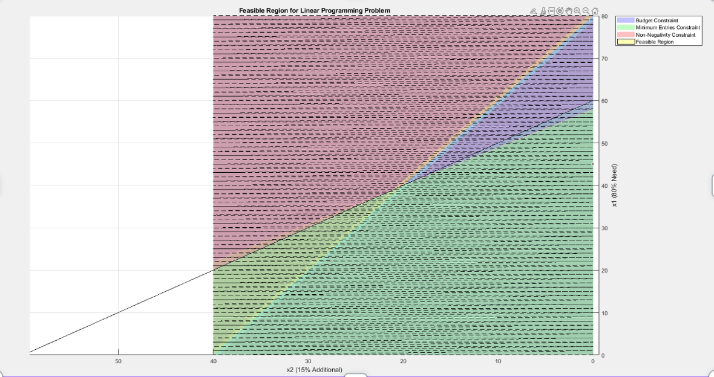
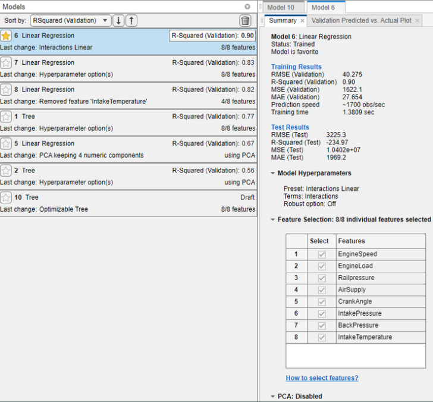
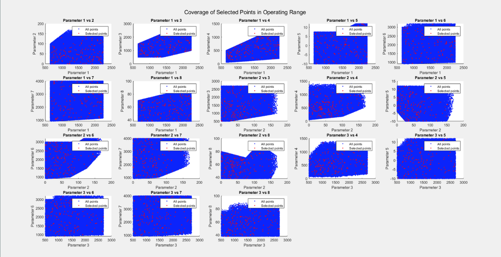
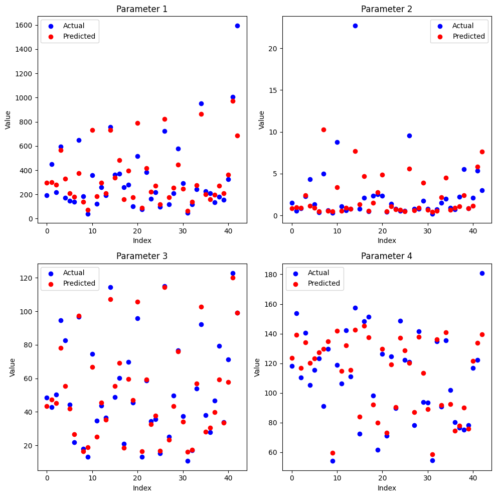

# Scoobydoo can do - Emissions Prediction 🚗

## Project Overview

This project aims to develop a model to predict vehicle emissions based on various engine parameters. The primary focus is on predicting NOx, PM 1, CO2 and pressure cylinder values. The project uses a regression model trained on a dataset containing multiple engine parameters such as engine speed, engine load, rail pressure, air supply, crank angle, intake pressure, back pressure, intake temperature, and more.

## 📊 Dataset

The dataset used for this project includes the following features:

- **Engine speed (rpm)**
- **Engine load**
- **Rail pressure**
- **Air supply**
- **Crank angle**
- **Intake pressure**
- **Back pressure**
- **Intake temperature**
- **NOx** (target variable)
- **PM 1** (target variable)
- **CO2** (target variable)
- **PM 2** (it has highly inpredictable behavior so we will not target it)
- **Pressure cylinder** (target variable)

The dataset is formatted as a CSV file with each row representing a different set of engine parameters and corresponding emission values.
We sarted with 100 Data and then trained it on up to 500.

## Strategie :
- Find the Optimal model parameters for the given data
- Compare the performances of Models (MSE & R^2)
- Optimal Feature Selection
- Multiple Testing and performance monitoring
## Side Task 1 : Datapoint Budget Optimization:
Rule 1 : Datapoint cost on the basis of their penalty 
- No Violation : -1
-  PM1 Violation : -2
- Pressure Violation : -11

Rule 2 : For a batch size of 80 credits we should get 60 datapoints

Rule 3 : Datapoints are rewarded as higher value they produce
- No Violation : +1
- PM1 Violation : +3
- Pressure Violation : +9

No Violation : 49 PM1 Violation : 10 Pressure Violation : 1
- - - 

So we decided that:
Choosen Model : Stepwise Linear Regresion 
Training points : 217 Datapoints
Number of steps : 1000
Features selected : 7/8
- - - 
Then we satrted focusing on Maximizing the coverage of usable region

Mean Coverage of Parameters : 91.63
- - - 
How is the prediction looking like : 

